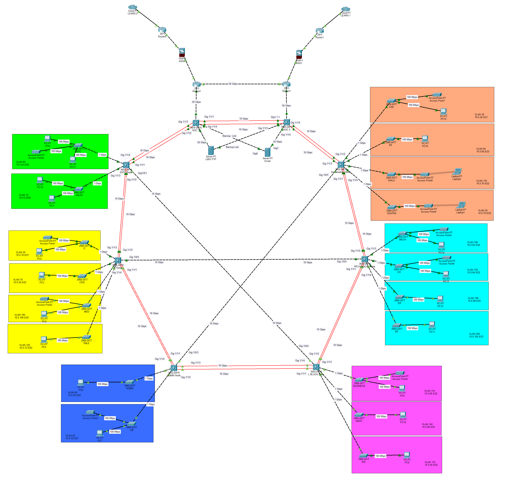
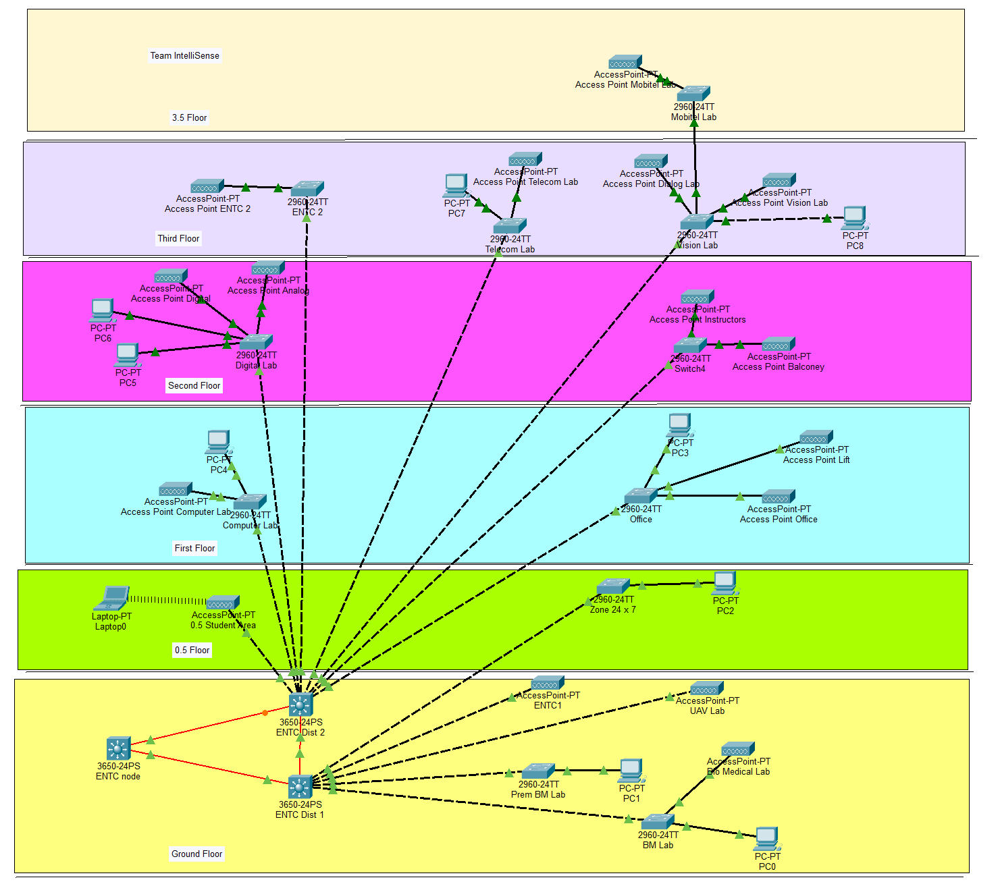
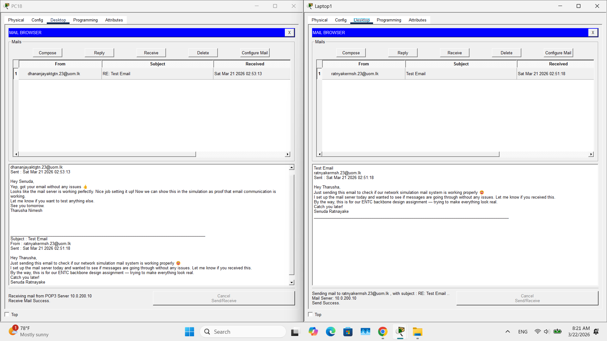
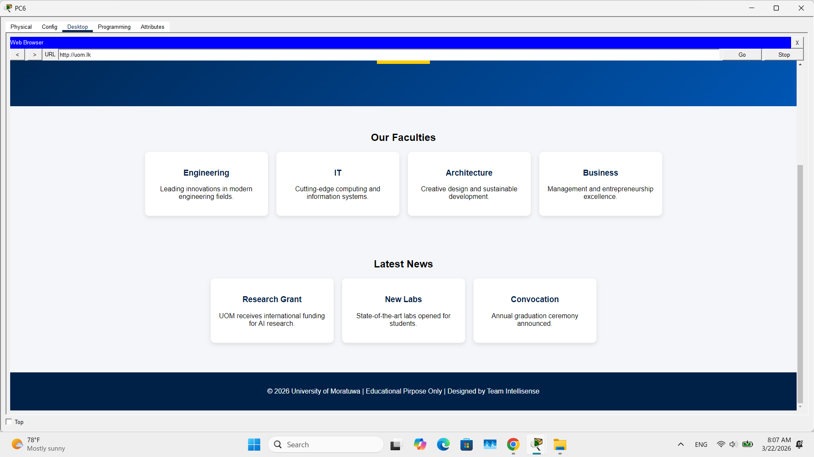
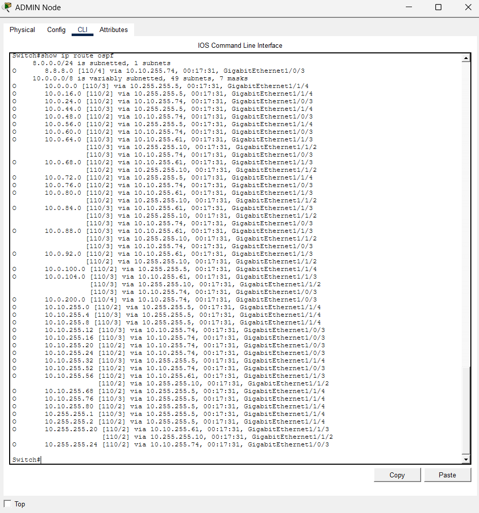

# University of Moratuwa LAN & Backbone Network Design

This repository contains the design, simulation, and documentation for the **University of Moratuwa (UoM) backbone network** and the **ENTC building LAN**. The project focuses on creating a scalable, cost-effective, and reliable network infrastructure using Cisco Packet Tracer.

---

## Table of Contents
- [Project Overview](#project-overview)
- [Design Requirements](#design-requirements)
- [Network Architecture](#network-architecture)
- [Simulation Results](#simulation-results)
- [Component Selection](#component-selection)
- [References](#references)
- [License](#license)

---

## Project Overview
The network design aims to:
- Connect all faculties, departments, and common areas of UoM with high-speed, redundant links.
- Implement a scalable and hierarchical LAN for the ENTC building.
- Use VLAN-based segmentation, OSPF routing, and Spanning Tree Protocol (STP) to ensure efficient data transfer and fault tolerance.

Simulation and testing are conducted using **Cisco Packet Tracer**.

---

## Design Requirements
- **Scalability:** Support future growth in the number of users and devices.
- **Redundancy:** Multiple paths and failover using OSPF and STP.
- **Cost Efficiency:** Balance performance with budget constraints.
- **IPv4 & IPv6 Support:** Dual-stack addressing with SLAAC for IPv6.

---

## Network Architecture

### University Backbone Network

- Hierarchical three-layer design:
  - **Core Layer:** High-performance Layer 3 switches for fast routing.
  - **Distribution Layer:** Connects faculties and departments.
  - **Access Layer:** Connects end devices like PCs and access points.
- **Topology:** Hybrid mesh-ring for redundancy and scalability.

### ENTC Building LAN

- VLAN-based internal network
- Spanning Tree Protocol (STP) to prevent loops
- OSPF routing for inter-department communication
- PCs, servers, switches, and access points connected and tested via Packet Tracer

---

## Simulation Results

### Application Layer Testing

Tested HTTP, HTTPS, and email communication within the network.

### OSPF Verification
  
Confirmed OSPF adjacency and routing table entries.

---

## Component Selection

**Active Components:**
- Cisco Catalyst 3650 and 2960-L switches
- Cisco 9105AX access points
- Cisco 2911 Router
- Cisco ASA 5500-X Firewall
- APIC Server M1-RF
- Cisco ENCS 5408 Cloud Server

**Passive Components:**
- Copper and fibre optic cables
- Patch panels
- Network racks

---

---

## References
- University of Moratuwa CITeS Services: [Backbone Network Management](https://uom.lk/cites/services/manage-backbone-network)
- Cisco Packet Tracer simulation files included in this repository

---

## License
This project is for academic purposes under the **EN2150 – Communication Network Engineering module**. All images and references are credited where applicable.
